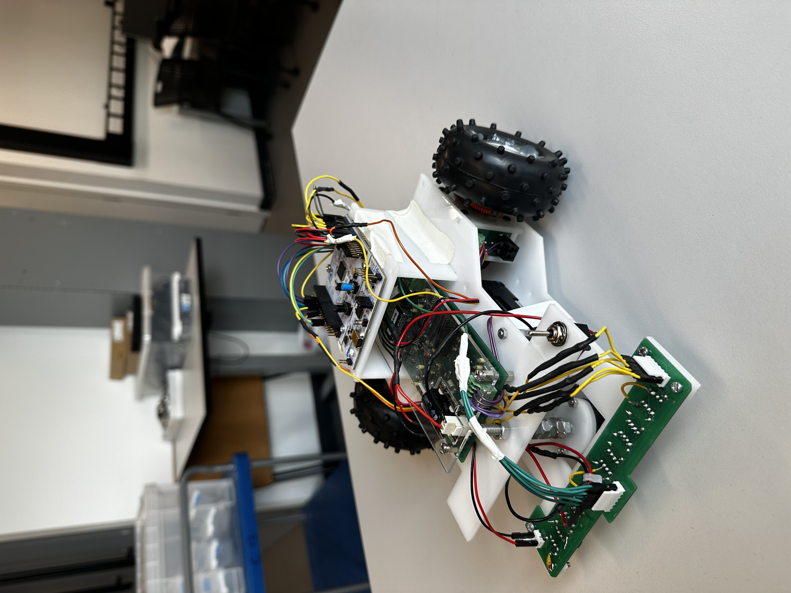
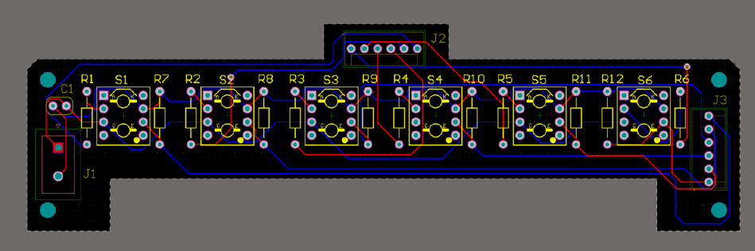

# **Group 2 ESP Buggy Project** 🚗  

### **🔗 Web App to Control the Buggy**  
- **Web App:** [esp-group-2.netlify.app](https://esp-group-2.netlify.app/)  
- **Web App Source Code:** [GitHub Repository](https://github.com/TylerWardUOM/ESP_Web_App)  

---
## 🏆 Technical Demonstrations — Results Summary
- **TD1:** 97%
- **TD2:** 99%
- **TD3:** 99%
- **TD4:** 80%
- ---
## **📸 Final Buggy — Photos & Media**
-  **Final Buggy** 
	

- **PCB Design**
	
---
## **📦 Required Dependencies**  

This project requires a specific version of **Mbed OS** and the **C12832 display library**.  

### **🛠 Mbed OS Version:**  
- **Mbed OS:** [Commit e592c8a](https://github.com/ARMmbed/mbed-os/tree/e592c8a8b2a7faf24fecdb2decccfde426523b99)  

### **📚 Additional Library:**  
- **C12832 Library:** [Commit 03069e3](https://os.mbed.com/teams/components/code/C12832/#03069e3deaa4b9054ee5ef6db455fd9c09ea6b71)  

---

